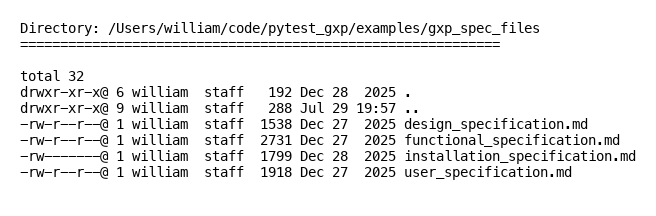
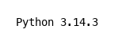
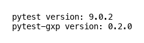
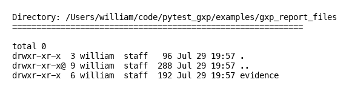

# Operational Qualification Report

## Validation Information

- **Project:** Example Application
- **Software:** Example Application
- **Version:** 0.2.0
- **Validation Date:** 2026-07-29
- **Report Generated:** 2026-07-29T23:57:18Z
- **Source Revision:** e8932b2e5517cbe92cca93108349f79ee9c07bd6 [uncommitted changes] (source: git)

## Approvals

| Role | Name | Date | Signature |
|------|------|------|-----------|
| Tester | John Smith | 2025-01-15 |  |
| Reviewer | Jane Doe | 2025-01-16 |  |
| Approver | Robert Johnson | 2025-01-17 |  |

## Validation Findings

| Severity | Code | Location | Message |
|----------|------|----------|---------|
| warning | uncovered-requirement | - | Requirement DS-001 has no test coverage |
| warning | uncovered-requirement | - | Requirement DS-002 has no test coverage |
| warning | uncovered-requirement | - | Requirement DS-003 has no test coverage |
| warning | uncovered-requirement | - | Requirement FS-003 has no test coverage |
| warning | uncovered-requirement | - | Requirement FS-004 has no test coverage |
| warning | uncovered-requirement | - | Requirement US-001 has no test coverage |
| warning | uncovered-requirement | - | Requirement US-002 has no test coverage |
| warning | uncovered-requirement | - | Requirement US-003 has no test coverage |

## Specifications

### Design Specification
- **Title:** Design Specification
- **Version:** 1.0
- **Requirements:** 3

### Functional Specification
- **Title:** Functional Specification
- **Version:** 1.0
- **Requirements:** 4

### User Specification
- **Title:** User Specification
- **Version:** 1.0
- **Requirements:** 3

## Test Execution Summary

- **Total Tests:** 13
- **Executed:** 5
- **Passed:** 5
- **Failed:** 0
- **Skipped:** 0
- **Errors:** 0
- **Not Executed:** 8
- **Test Pass Rate:** 100.0%
- **Test Execution Rate:** 38.5%

## Requirement Coverage Summary

- **Total Requirements:** 13
- **Requirements with Tests:** 5
- **Requirements without Tests:** 8
- **Requirement Coverage Rate:** 38.5%

- **Requirements Verified (passing tests):** 5
- **Verification Rate:** 38.5%

## Test Cases

| Test Case ID | Title | Requirements | Status | Evidence |
|--------------|-------|--------------|--------|----------|
| TEST-FS-001 | Test FS-001: User Login Functionality | FS-001 | PASSED | - |
| TEST-FS-002 | Test FS-002: Input Data Validation | FS-002 | PASSED | - |
| TEST-FS-003 | Test FS-003: Audit Logging | FS-003 | Not Executed | - |
| TEST-FS-004 | Test FS-004: User Profile Management | FS-004 | Not Executed | - |
| TEST-DS-001 | Test DS-001: User Authentication System | DS-001 | Not Executed | - |
| TEST-DS-002 | Test DS-002: Data Validation | DS-002 | Not Executed | - |
| TEST-DS-003 | Test DS-003: Audit Trail | DS-003 | Not Executed | - |
| TEST-IS-001 | Test IS-001: System Requirements Verification | IS-001 | PASSED | [EV-0001](#evidence-test_example_py_test_python_version_requirement), [EV-0002](#evidence-test_example_py_test_required_packages_installed) |
| TEST-IS-002 | Test IS-002: Application Installation | IS-002 | PASSED | - |
| TEST-IS-003 | Test IS-003: Configuration Verification | IS-003 | PASSED | [EV-0003](#evidence-test_example_py_test_plugin_imports), [EV-0004](#evidence-test_example_py_test_specification_parser_initialization) |
| TEST-US-001 | Test US-001: Secure User Access | US-001 | Not Executed | - |
| TEST-US-002 | Test US-002: Data Accuracy | US-002 | Not Executed | - |
| TEST-US-003 | Test US-003: Activity Tracking | US-003 | Not Executed | - |

## Test Execution

| Node ID | Outcome | Requirements | Deviation Ref | Reason |
|---------|---------|--------------|---------------|--------|
| test_example.py::test_input_data_validation | PASSED | FS-002 | — | - |
| test_example.py::test_plugin_entry_point | PASSED | IS-002 | — | - |
| test_example.py::test_plugin_imports | PASSED | IS-003 | — | - |
| test_example.py::test_python_version_requirement | PASSED | IS-001 | — | - |
| test_example.py::test_required_packages_installed | PASSED | IS-001 | — | - |
| test_example.py::test_specification_parser_initialization | PASSED | IS-003 | — | - |
| test_example.py::test_user_login_functionality | PASSED | FS-001 | — | - |

## Objective Evidence

Total evidence items: 4

### test_example.py::test_plugin_imports

**EV-0003**: Specification files directory

- **Type:** directory_listing
- **Requirements:** IS-003
- **Timestamp:** 2026-07-29T23:57:18Z

### test_example.py::test_python_version_requirement

**EV-0001**: Python version verification

- **Type:** command_output
- **Requirements:** IS-001
- **Timestamp:** 2026-07-29T23:57:18Z

### test_example.py::test_required_packages_installed

**EV-0002**: Required packages verification

- **Type:** command_output
- **Requirements:** IS-001
- **Timestamp:** 2026-07-29T23:57:18Z

### test_example.py::test_specification_parser_initialization

**EV-0004**: Report files directory

- **Type:** directory_listing
- **Requirements:** IS-003
- **Timestamp:** 2026-07-29T23:57:18Z

